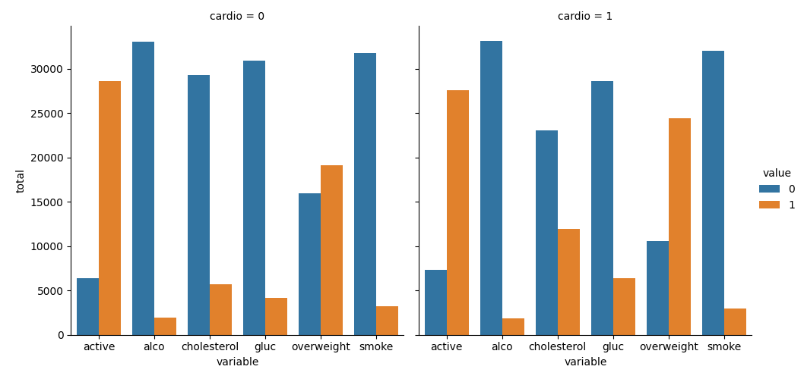
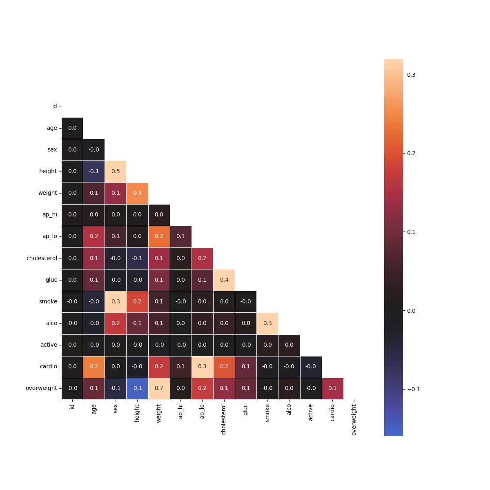

# Medical Data Visualizer
> A Python data visualization script that explores relationships between cardiac disease, body measurements, blood markers, and lifestyle choices using Pandas, Matplotlib, and Seaborn — built as Project 3 of the freeCodeCamp Data Analysis with Python certification.

---

## Overview (Situation)
**Context:** Medical examination datasets contain a mix of objective measurements (height, weight, blood pressure), lab results (cholesterol, glucose), and self-reported lifestyle data (smoking, alcohol, physical activity). Visualizing how these factors distribute across patients with and without cardiovascular disease is a standard step in exploratory medical data analysis.

**Problem:** The project required two distinct outputs from a single dataset of 70,000 patient records: a categorical bar chart showing the distribution of risk factors split by cardiovascular disease status, and a correlation heatmap showing how all numeric variables relate to each other — after cleaning out medically invalid records.

---

## What I Built

### Key Features
- BMI-based overweight classification — computes BMI from height and weight, then creates a binary overweight column (0 = healthy, 1 = overweight) using vectorized comparison
- Data normalization — recodes cholesterol and glucose from a 3-point scale to binary (0 = normal, 1 = above normal) so all categorical features use the same scale for fair visual comparison
- Categorical plot — uses `pd.melt()` to reshape the data from wide to long format, then `sns.catplot()` to produce side-by-side bar charts split by cardiovascular disease status
- Correlation heatmap — filters out medically invalid records using blood pressure and height/weight percentile thresholds, computes a full correlation matrix, and renders it with a triangular mask to eliminate redundant values


### Challenges Solved
- **Understanding `pd.melt()` for reshaping:** The catplot requires data in long format — one row per patient per variable — rather than the wide format the CSV provides. `pd.melt()` with `id_vars=['cardio']` unpivots all six feature columns into two columns (`variable` and `value`), which is what `sns.catplot()` needs to split bars by value and panel by cardio status.

- **Seaborn catplot returns FacetGrid, not Axes:** `sns.catplot()` returns a `FacetGrid` object, not a standard Matplotlib `Axes`. Accessing the underlying figure requires `.fig` on the returned object — without this, `fig.savefig()` raises an `AttributeError`. This is a common source of confusion when mixing Seaborn and Matplotlib APIs.

- **Data cleaning with percentile thresholds:** Filtering on `quantile(0.025)` and `quantile(0.975)` removes the extreme 2.5% on each end of the height and weight distributions. These records likely represent data entry errors rather than genuine outliers, and including them would distort both the correlation matrix and the heatmap color scale.

---

## Results and Impact
- Both unit tests passing with 0 errors
- Produces two publication-quality chart outputs: `catplot.png` and `heatmap.png`
- Correctly handles 70,000 patient records with data cleaning, normalization, and reshaping before visualization

---

## Output

| Categorical Plot | Heatmap |
|---|---|
|  |  |

---

## Getting Started

```bash
git clone https://github.com/MarlanAlfonso/boilerplate-medical-data-visualizer.git
pip install pandas matplotlib seaborn numpy
python3 main.py
```

The script generates two output files in the project directory:
- `catplot.png` — categorical bar chart split by cardiovascular disease status
- `heatmap.png` — lower triangle correlation heatmap of all numeric features

---

## What I Learned
- Learned how `pd.melt()` reshapes wide-format DataFrames into long format — a necessary transformation before feeding data into Seaborn's categorical plot functions
- Understood that `sns.catplot()` returns a `FacetGrid` object, not an `Axes`, and that `.fig` is required to access the underlying Matplotlib figure for saving
- Gained experience cleaning medical data using percentile-based filtering (`quantile(0.025)` and `quantile(0.975)`) to remove records that fall outside clinically plausible ranges
- Learned to generate and apply a triangular mask with `np.triu()` to hide the redundant upper half of a symmetric correlation matrix in a Seaborn heatmap
- Practiced feature engineering by deriving a binary classification column (overweight) from two continuous variables (height and weight) using a vectorized BMI formula
