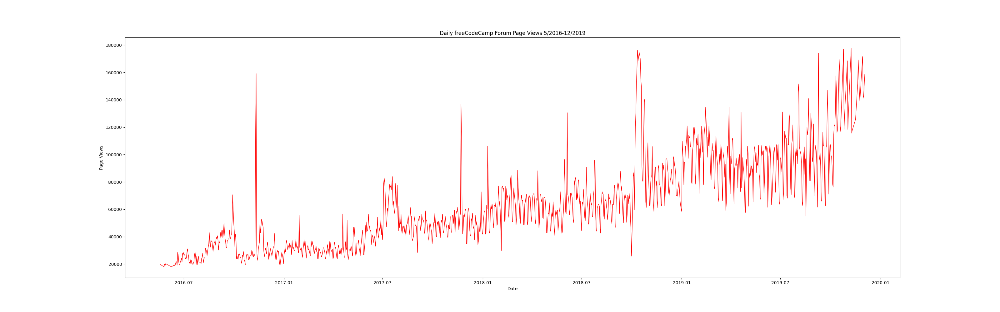
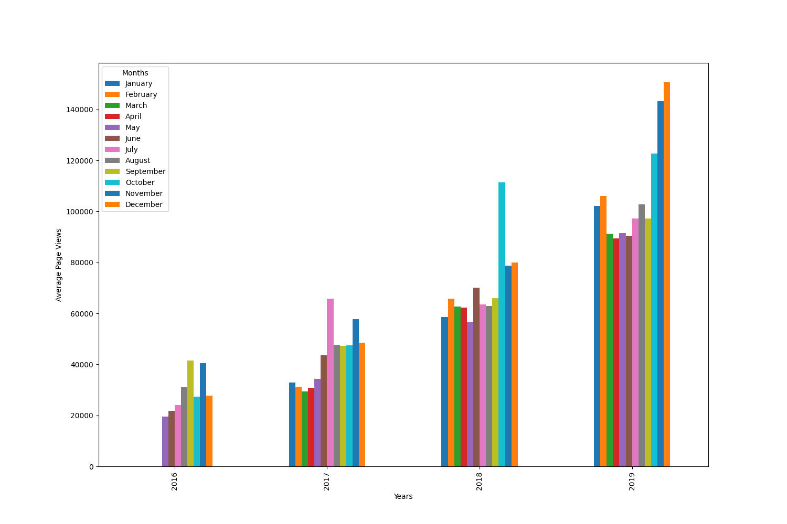
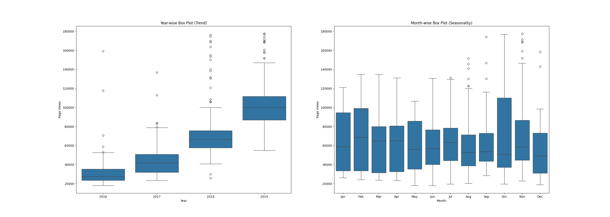

# Page View Time Series Visualizer
> A Python time series visualization script that reveals growth trends and seasonal patterns in freeCodeCamp forum traffic from 2016 to 2019 using Pandas, Matplotlib, and Seaborn — built as Project 4 of the freeCodeCamp Data Analysis with Python certification.

---

## Overview 
- **Context:** Time series data — measurements taken at regular intervals over time — requires specialized visualization techniques to reveal patterns that standard charts miss. A single number like "average page views" hides whether traffic is growing year over year, whether certain months consistently spike, and how spread out the daily values are within any given period.

- **Problem:** The project required producing three distinct chart types from the same dataset of daily forum page view counts: a line chart to show the raw trend, a grouped bar chart to compare monthly averages across years, and side-by-side box plots to expose both long-term growth and seasonal variation — all after cleaning outliers from the top and bottom 2.5% of the data.

---

## What I Built (Action)

### Key Features
- Datetime indexing — loads the CSV with `index_col='date'` and `parse_dates=True` so the index is a proper `DatetimeIndex`, enabling `.dt.year`, `.dt.month`, and time-based slicing throughout
- Outlier cleaning — removes the top and bottom 2.5% of page view values using `quantile(0.025)` and `quantile(0.975)` before any visualization, ensuring charts are not distorted by data spikes or recording errors
- Line chart — plots the full cleaned daily time series with correct axis labels and title using the Matplotlib object-oriented API
- Grouped bar chart — uses `groupby(['year', 'month'])` and `.unstack()` to pivot the data into a year-by-month matrix, then plots grouped bars with month names as the legend
- Box plots — produces two adjacent Seaborn box plots: one grouped by year to show the upward trend, and one grouped by month in calendar order to reveal seasonal patterns

### Challenges Solved
- **Month ordering in the box plot:** Seaborn sorts categorical x-axis values alphabetically by default, which produces an incorrect month order (Apr, Aug, Dec...). Passing `order=['Jan', 'Feb', 'Mar', ...]` explicitly to `sns.boxplot()` enforces calendar order — without this the seasonality chart is visually misleading.
- **Pivoting for the grouped bar chart:** Pandas' `groupby(['year', 'month'])['value'].mean()` returns a Series with a MultiIndex. Calling `.unstack()` on it converts the month level of the index into columns, producing a year-by-month DataFrame that `.plot(kind='bar')` can render as a grouped bar chart directly — no manual looping required.
- **Using copies to prevent cross-function contamination:** Each draw function starts with `df.copy()` before adding derived columns like `year` and `month`. Without this, columns added in one function would persist in the global `df` and potentially affect the other functions when tests run them in sequence.

---

## Results and Impact

- All 3 unit tests passing with 0 errors
- Produces three chart output files: `line_plot.png`, `bar_plot.png`, `box_plot.png`
- Charts correctly show year-over-year growth in forum traffic and a consistent seasonal dip in the early months of each year

---

## Output

| Line Plot | Bar Plot | Box Plots |
|---|---|---|
|  |  |  |

---

## Getting Started

```bash
git clone https://github.com/MarlanAlfonso/boilerplate-page-view-time-series-visualizer.git
pip install pandas matplotlib seaborn
python3 main.py
```

The script generates three output files in the project directory:
- `line_plot.png` — daily page views from May 2016 to December 2019
- `bar_plot.png` — average monthly page views grouped by year
- `box_plot.png` — distribution of page views by year and by month

---

## What I Learned
- Learned how to load time series data with a proper `DatetimeIndex` using `index_col` and `parse_dates` in `pd.read_csv()`, enabling `.dt` accessor methods for extracting year and month components
- Understood how `groupby().unstack()` converts a MultiIndex Series into a pivot table suitable for grouped bar charts — a pattern used constantly in reporting and dashboarding workflows
- Gained hands-on experience with the Seaborn `order` parameter for categorical plots, which is essential any time the natural sort order of a categorical variable differs from its logical order
- Learned why each visualization function must operate on `df.copy()` rather than the global DataFrame — mutating shared state across functions causes test failures that are difficult to trace
- Practiced producing multiple chart types from the same dataset, reinforcing that the choice of chart (line vs. bar vs. box) encodes fundamentally different information about the same underlying data