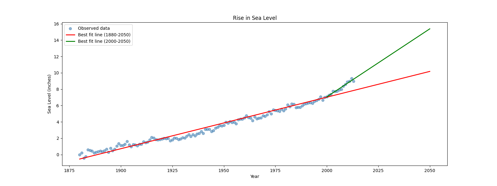

# Sea Level Predictor
> A Python data analysis script that uses linear regression to visualize historical global sea level rise since 1880 and predict rise through 2050 under two rate scenarios — built as Project 5 of the freeCodeCamp Data Analysis with Python certification.

---

## Overview (Situation)
- **Context:** Global average sea level has been rising as a consequence of climate change, with the rate of rise accelerating in recent decades. The US Environmental Protection Agency maintains a dataset of annual sea level measurements going back to 1880, adjusted for local land movement to reflect true ocean-level change.

- **Problem:** The project required producing a single chart that simultaneously shows the historical scatter of observed measurements, a long-term trend line fitted to all data from 1880, and a second trend line fitted only to data from 2000 onward — both extended to 2050 to compare predicted sea level rise under different rate assumptions.

---

## What I Built (Action)

### Key Features
- Scatter plot of observed data — plots all 134 years of annual sea level measurements as individual points, providing the visual context for both regression lines
- Full-period regression line — fits a linear model to all data from 1880 and extends the prediction to 2050, representing the long-term average rate of rise
- Recent-period regression line — fits a second linear model using only data from 2000 onward and extends it to 2050, representing the accelerated modern rate of rise and producing a steeper, higher 2050 prediction
- Side-by-side comparison — both lines appear on the same chart, making it immediately clear that the rate of sea level rise has accelerated and that 2050 predictions differ significantly depending on which time window is used

### Challenges Solved
- **Extending regression lines beyond the dataset:** `linregress` fits a model to existing data but does not predict future values automatically. The prediction requires manually constructing a new x-axis range — `pd.Series(range(1880, 2051))` for the full period and `pd.Series(range(2000, 2051))` for the recent period — then computing `y = slope * x + intercept` for each point. This is the core pattern for making linear predictions in Python.
- **Two regressions on the same axes:** Both lines are plotted on the same `ax` object using separate `ax.plot()` calls. Each call uses its own slope, intercept, and x range — they are completely independent computations that happen to share the same visual canvas. The legend labels distinguish them for the reader.

---

## Results and Impact
- All 4 unit tests passing with 0 errors
- Produces `sea_level_plot.png` showing observed data and both prediction lines through 2050
- The recent-period regression (2000-2050) predicts a meaningfully higher sea level by 2050 than the full-period regression, visually demonstrating the acceleration of sea level rise in the modern era

---

## Output

| Sea Level Prediction Chart |
|---|
|  |

---

## Getting Started

```bash
git clone https://github.com/MarlanAlfonso/boilerplate-sea-level-predictor.git
pip install pandas matplotlib scipy
python3 main.py
```

The script generates one output file:
- `sea_level_plot.png` — scatter plot with two linear regression lines extended to 2050

---

## What I Learned
- Learned how to apply `scipy.stats.linregress()` to fit a linear regression model, extracting the slope and intercept to construct a prediction line — a foundational technique in predictive data analysis
- Understood that regression predictions beyond the dataset range require manually constructing a new x-axis Series and computing `y = slope * x + intercept`, rather than relying on the library to extrapolate automatically
- Gained experience plotting multiple independent data series on the same Matplotlib axes using repeated `ax.plot()` calls, each with its own data, color, and legend label
- Practiced filtering a DataFrame by a column threshold (`df[df['Year'] >= 2000]`) to isolate a time window for a secondary analysis — a pattern used constantly in time series work
- Learned to interpret the practical difference between two regression models: the full-period model reflects the long-term average rate while the recent-period model captures the accelerating trend, producing a higher 2050 prediction
